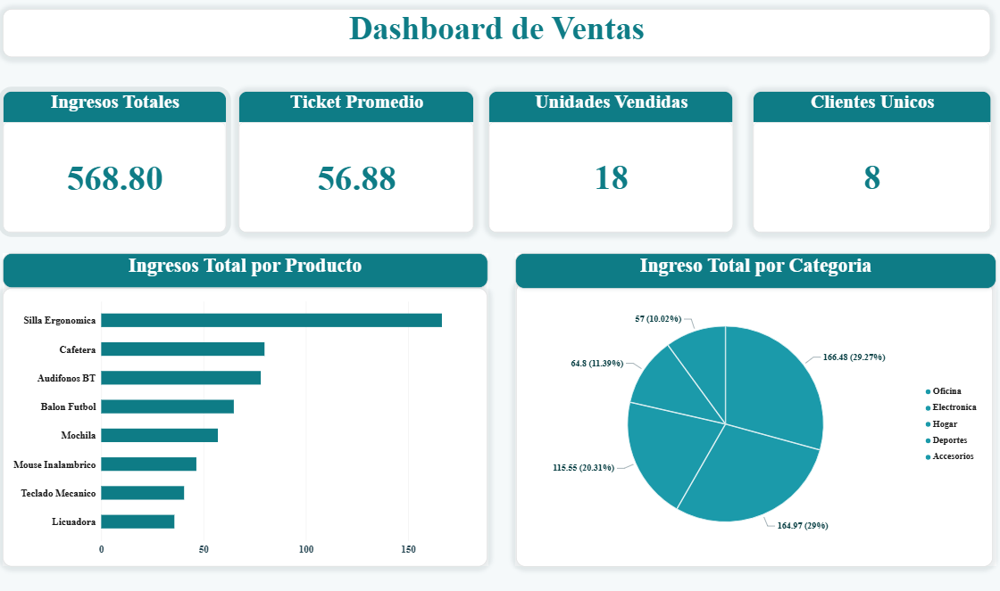
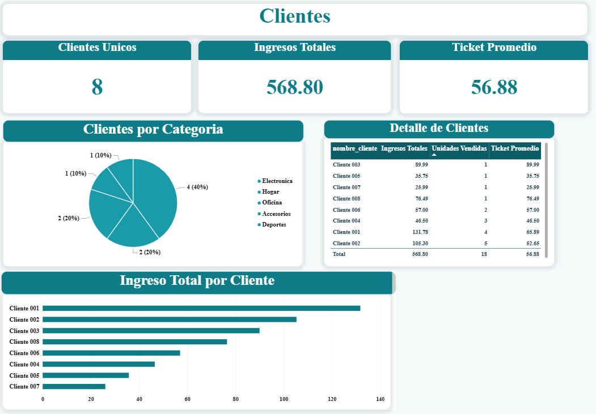
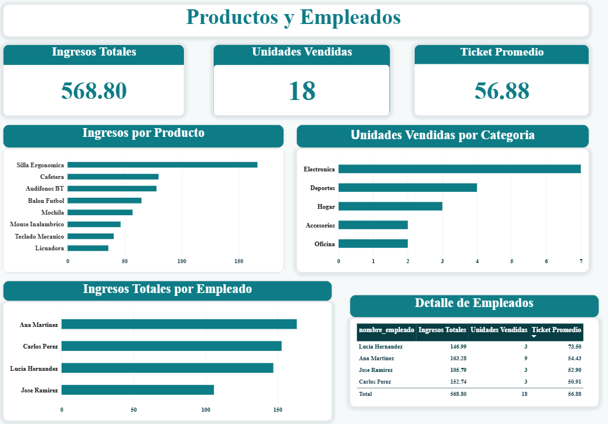

# 📊 Analisis_Ventas

Proyecto de análisis de ventas de una tienda retail ficticia. Integra una base de datos relacional en MySQL, datos de origen preparados en LibreOffice Calc/Excel, y un dashboard interactivo desarrollado en Power BI.

## Tecnologías usadas

- **MySQL** — base de datos relacional, modelo de tablas, vistas y consultas de análisis
- **Visual Studio Code** — desarrollo de scripts SQL y control de versiones con Git
- **LibreOffice Calc / Excel** — datos de origen
- **Power BI** — dashboard interactivo conectado en vivo a MySQL

## Estructura del proyecto

Analisis_Ventas/
├── capturas/ # Screenshots del dashboard de Power BI
│ ├── clientes.png
│ ├── productos_empleados.png
│ └── resumen.png
├── data/ # Datos de origen
│ ├── clientes.csv
│ ├── empleados.csv
│ ├── productos.csv
│ ├── ventas_raw.xlsx
│ └── ventas.csv
├── powerbi/ # Dashboard de Power BI
│ └── Dashboard_Ventas.pbix
├── sql/ # Scripts SQL
│ ├── 01_schema.sql
│ ├── 02_carga_datos.sql
│ ├── 03_consultas_analisis.sql
│ └── 04_vistas_powerbi.sql
└── README.md

## Modelo de datos

Modelo tipo estrella: una tabla de hechos `ventas` conectada a tres tablas de dimensión (`clientes`, `productos`, `empleados`).

​```
clientes (cliente_id PK) ─┐
productos (producto_id PK)─┼──► ventas (venta_id PK, FKs)
empleados (empleado_id PK)─┘
​```

- **clientes**: id, nombre, ciudad, segmento, fecha de registro
- **productos**: id, nombre, categoría, precio unitario
- **empleados**: id, nombre, región
- **ventas**: id, fecha, cliente, producto, empleado, cantidad, precio, descuento, monto total


## Cómo reproducirlo

1. Ejecuta `sql/01_schema.sql` para crear la base de datos y las tablas
2. Ejecuta `sql/02_carga_datos.sql` para cargar los datos desde la carpeta `data/`
3. Ejecuta `sql/03_consultas_analisis.sql` para ver los análisis de negocio (ventas por mes, top productos, ranking de empleados, etc.)
4. Ejecuta `sql/04_vistas_powerbi.sql` para crear la vista `vw_ventas_detalle`
5. Abre `powerbi/Dashboard_Ventas.pbix` en Power BI Desktop, o conéctate tú mismo a la base `analisis_ventas` usando esa vista

## Dashboard en Power BI

### Página Resumen


### Página Clientes


### Página Productos y Empleados


El dashboard incluye:
- 4 indicadores clave (KPIs): Ingresos Totales, Ticket Promedio, Unidades Vendidas, Clientes Únicos
- Gráfico de ingresos por producto
- Gráfico de ingresos por categoría
- Detalle de clientes y su historial de compra
- Detalle de productos y desempeño de empleados

## Hallazgos principales

- El producto con más ingresos generados fue **Silla Ergonómica**.
- La categoría **Electrónica** concentra la mayor parte de las ventas.
- El ticket promedio de compra fue de **$56.88**.
- Se identificaron 8 clientes únicos con actividad de compra en el periodo analizado.

## Autor

Jimena Turcios — [github.com/jimenaturcios448](https://github.com/jimenaturcios448)